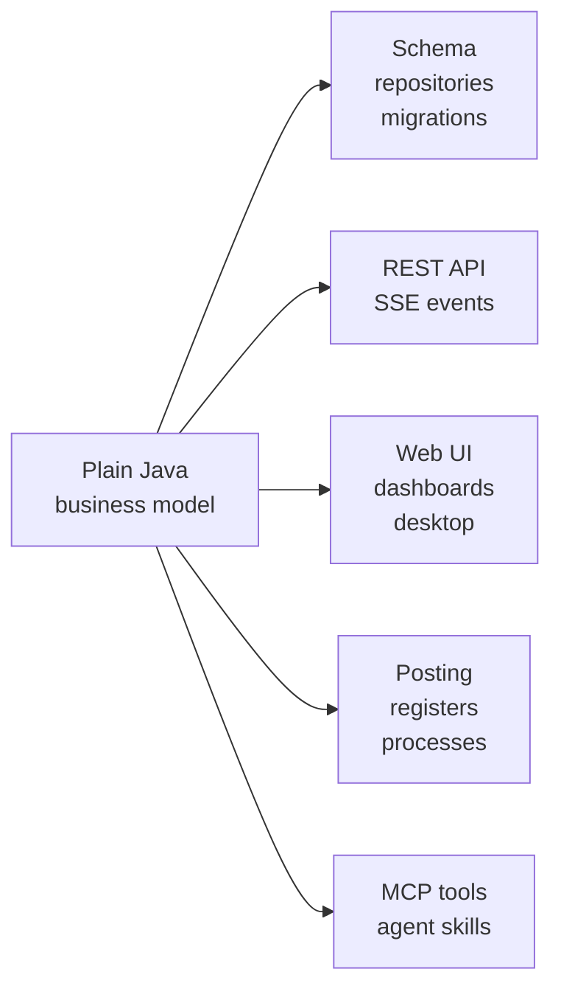

<div align="center">
  <a href="https://onno.su/">
    
  </a>

  <br />
  <br />

  <h1>onno-framework</h1>

  <p>
    <strong>A Java and Spring framework for business software that fits the operation—not the other way around.</strong>
  </p>

  <p>
    <a href="https://central.sonatype.com/artifact/su.onno/onno-framework-starter"></a>
    <a href="https://github.com/onno-erp/onno-framework/actions/workflows/docs.yml"></a>
    
    
    <a href="LICENSE"></a>
  </p>

  <p>
    <a href="https://onno.su/"><strong>Website</strong></a>
    ·
    <a href="https://docs.onno.su/"><strong>Documentation</strong></a>
    ·
    <a href="https://demo.cloud.onno.su/ui"><strong>Live demo</strong></a>
    ·
    <a href="example"><strong>Example app</strong></a>
    ·
    <a href="onno-crm-starter"><strong>CRM module</strong></a>
    ·
    <a href="CONTRIBUTING.md"><strong>Contributing</strong></a>
  </p>
</div>

---

## Write the truth once. Generate the boring parts.

onno models a business as explicit, compiler-checked Java: catalogs, documents, line items,
registers, rules, and durable processes. From that model it generates the infrastructure every
business system needs:

| Model in plain Java | Generated by onno | Kept in your control |
| --- | --- | --- |
| Business entities and references | Database schema and safe migrations | Posting and lifecycle rules |
| Documents and line items | Typed repositories and authenticated REST | Integrations and custom services |
| Balances and historical facts | Role-aware web UI and dashboards | UI composition and custom widgets |
| Human and automatic processes | Tasks, events, and MCP tools for AI agents | Every source file and every deployment |

No proprietary designer. No duplicated table, DTO, API, and form definitions. No framework-specific
language for the logic that makes the business unique.

```java
@Catalog(name = "Customers", codePrefix = "C-", context = "Sales")
public class Customer extends CatalogObject {
    @Attribute(required = true, length = 200)
    private String name;
}

@Document(name = "Sales Orders", numberPrefix = "SO-", context = "Sales")
public class SalesOrder extends DocumentObject implements Postable {
    @Attribute(required = true)
    private Ref<Customer> customer;

    @TabularSection(name = "items")
    private List<SalesOrderLine> items = new ArrayList<>();

    @Override
    public void handlePosting(PostingContext context) {
        var stock = context.movements(Stock.class);
        items.forEach(line -> stock.addExpense(movement -> {
            movement.setWarehouse(line.getWarehouse());
            movement.setProduct(line.getProduct());
            movement.setQuantity(line.getQuantity());
        }));
    }
}
```

<div align="center">
  <a href="https://demo.cloud.onno.su/ui">
    
  </a>
  <br />
  <sub>The generated UI is ready to use, role-aware, and fully authorable from Java. <a href="https://demo.cloud.onno.su/ui">Open the live demo →</a></sub>
</div>

## How it works



1. **Model the operation.** Name the customers, orders, stock, payments, events, and rules the
   company actually works with.
2. **Generate the system.** onno creates the data layer, authenticated APIs, role-aware interface,
   migration plan, and AI-accessible tool surface.
3. **Code what is unique.** Integrations, posting logic, workflows, and policies stay ordinary,
   testable Java in your repository.

## Quick start

onno 2.0 requires Java 21 and Spring Boot 3.4.x. Released artifacts are on Maven Central under
`su.onno`; no credentials or custom repository are required.

```kotlin
plugins {
    java
    id("org.springframework.boot") version "3.4.4"
    id("io.spring.dependency-management") version "1.1.7"
}

repositories {
    mavenCentral()
}

val onnoVersion = "2.0.0"

dependencies {
    implementation("su.onno:onno-framework-starter:$onnoVersion")
    implementation("su.onno:onno-ui-starter:$onnoVersion")
    implementation("su.onno:onno-auth-starter:$onnoVersion")
    runtimeOnly("com.h2database:h2")
}
```

Give the app a datasource and a development user:

```yaml
spring:
  datasource:
    url: jdbc:h2:file:./data/app
    driver-class-name: org.h2.Driver
    username: sa

onno:
  auth:
    users:
      - username: admin
        password: admin # development only
        roles: [ADMIN]
```

Put your annotated model under the `@SpringBootApplication` package and start the application.
onno scans the model, creates the schema, wires the repositories, and serves the UI.

For a complete runnable project with seeded data, posting, role-specific layouts, dashboards,
comments, media, and live custom widgets backed by the host's shared SSE stream, see the
[Onno Books example](example). For a high-density customer workspace with a unified seeded
multi-channel inbox, replies, internal notes, assignment, lifecycle stages, and opportunities, see
the reusable [CRM starter](onno-crm-starter).

Custom widgets can import ordinary npm libraries without adding a frontend project: declare them
with `onnoWidgets { npmDependencies.put("package", "version") }`; the managed widget build installs
and bundles them while keeping React and `@onno/widget-sdk` host-owned.

Custom widgets can import ordinary npm libraries without adding a frontend project: declare them
with `onnoWidgets { npmDependencies.put("package", "version") }`; the managed widget build installs
and bundles them while keeping React and `@onno/widget-sdk` host-owned.

## Business concepts

| If the business has… | Model it as… |
| --- | --- |
| Master data such as products, customers, warehouses, or employees | `@Catalog` |
| A fixed set of states or categories | `@Enumeration` |
| A dated, numbered event such as an order, invoice, or shipment | `@Document` |
| Repeated rows inside a document | `@TabularSection` |
| Current stock, cash, points, or other balances | `@AccumulationRegister(type = BALANCE)` |
| Revenue, hours, or other period activity | `@AccumulationRegister(type = TURNOVER)` |
| Prices, rates, or other facts that change over time | `@InformationRegister` |
| A singleton business setting | `@Constant` |
| Durable human and automatic work across several steps | `ProcessDefinition<P, S>` |
| A future service or team boundary | `context = "…"` |

The model remains small because references are typed (`Ref<T>`), behavior uses ordinary Java
interfaces, and UI metadata lives in focused `Layout`, `Page`, and `EntityView` beans.

## What ships

| Area | Packages and modules |
| --- | --- |
| Foundation | [`onno-framework`](onno-framework), [`onno-framework-starter`](onno-framework-starter) |
| Application surface | [`onno-ui-starter`](onno-ui-starter), [`onno-auth-starter`](onno-auth-starter) |
| Composable messaging | [`onno-crm-starter`](onno-crm-starter) |
| Data and integration | [`onno-import-starter`](onno-import-starter), [`onno-kafka-starter`](onno-kafka-starter), [`onno-cluster-starter`](onno-cluster-starter) |
| AI and operations | [`onno-mcp-starter`](onno-mcp-starter), [`onno-observability-starter`](onno-observability-starter) |
| Native and custom UI | [`onno-desktop-starter`](onno-desktop-starter), [`onno-desktop-gradle-plugin`](onno-desktop-gradle-plugin), [`onno-widgets-gradle-plugin`](onno-widgets-gradle-plugin), [`@onno/widget-sdk`](onno-widget-sdk) |
| Consumer examples | [`example`](example) |

Spring Boot starters expose auto-configuration through
`META-INF/spring/org.springframework.boot.autoconfigure.AutoConfiguration.imports`; adding a starter
is enough to make its conditional beans available.

Commercial vertical connectors are distributed separately from the private `onno-enterprise`
repository. Authentication—including OIDC and SSO—remains in the Apache-2.0 open core.

Applications add `implementation("su.onno:onno-crm-starter:$onnoVersion")` and explicitly bind
their existing customer catalog with `CrmCustomerBinding`. The starter supplies messaging and the
inbox widget; the host owns customers, employees, fields, permissions, pages and navigation.
Assignment, conversation statuses and personal groups are optional. The sales pipeline is an
ordinary onno recipe under `example/src/sales/java`, not part of the CRM artifact. See the
[composition guide](onno-crm-starter/README.md).

## Designed for humans and AI agents

The same typed model that drives the application also gives agents a safe, inspectable surface:

- `onno-mcp-starter` exposes metadata, reads, writes, register queries, posting, and custom
  `@McpTool` methods with the application's authorization rules.
- The [`onno` agent skills](onno-plugin/skills/onno/SKILL.md) teach coding agents how to model a
  business, author UI, implement posting, evolve schemas, and verify a running application.
- [Building ERPs with onno and AI agents](BUILDING_ERPS_WITH_AGENTS.md) is the end-to-end handoff
  guide for a separate application repository.

Claude Code users can install the skills directly from this repository:

```text
/plugin marketplace add onno-erp/onno-framework
/plugin install onno@onno-framework
```

## Documentation

The complete documentation is published at [docs.onno.su](https://docs.onno.su/), including
hand-written guides, generated configuration reference, and aggregated Javadocs.

| Start here | Purpose |
| --- | --- |
| [Architecture](docs/ARCHITECTURE.md) | Boot pipeline, subsystems, endpoint catalog, and open-core boundary |
| [Configuration](docs/CONFIGURATION.md) | Every `onno.*` property and default, generated from source metadata |
| [Headless Read API](docs/HEADLESS_READ_API.md) | JSON contracts, reference expansion, redaction, and keyset pagination |
| [Running and verification](docs/RUNNING.md) | Local development and authenticated runtime smoke tests |
| [3.0 release notes](docs/RELEASE_NOTES_3_0.md) | Composable CRM, breaking changes, and upgrade requirements |
| [2.0 release notes](docs/RELEASE_NOTES_2_0.md) | Highlights, breaking changes, and the release gate |
| [Migrating to 2.0](docs/MIGRATING_TO_2_0.md) | Source, data, and client migration checklist |
| [Extending onno](docs/EXTENDING.md) | Community connectors, SPI implementations, UI add-ons, and skills |
| [Community integrations](INTEGRATIONS.md) | Generated catalog of third-party projects |
| [Contributing](CONTRIBUTING.md) | Development workflow and contribution guidelines |
| [Java API](https://docs.onno.su/api/) | Aggregated Javadoc for the published API |

Each starter also has a focused README beside its source.

<details>
<summary><strong>Maintaining the generated documentation</strong></summary>

`docs/CONFIGURATION.md` is generated from the starters'
`spring-configuration-metadata.json`. Change a configuration property's Javadoc, then regenerate;
never hand-edit its table.

```bash
./gradlew generateConfigDocs
./gradlew checkConfigDocs
```

Preview the complete docs site:

```bash
./gradlew generateConfigDocs aggregateJavadoc
mkdir -p docs/public/api
cp -R build/docs/javadoc/. docs/public/api/
cd docs
npm install
npm run docs:dev
```

</details>

## Local development

The Gradle wrapper is the source of truth. Node 22.22 is downloaded automatically for the packaged
frontend.

```bash
./gradlew clean check
./gradlew publishToMavenLocal
./gradlew :example:bootRun
```

`publishToMavenLocal` is part of the verification loop: it catches sources, Javadoc, POM, and binary
artifact problems that project dependencies can hide.

For a save-to-screen loop, run the example and continuous compilation in separate terminals:

```bash
./gradlew :example:bootRun
./gradlew -t :example:classes
```

Spring Boot DevTools restarts the application context; onno rescans metadata, reapplies the schema
diff, rebuilds UI metadata, and tells connected browsers to refresh.

## Schema evolution

Structural migrations are derived from the model and diffed against the live database at startup.
`onno.schema.mode` controls whether onno applies, plans, validates, or ignores that diff:

```properties
onno.schema.mode=apply
onno.schema.allow-destructive=false
```

Safe additions, renames, and widening changes apply automatically. Drops and narrowing changes
require an explicit destructive-change opt-in. Use `previousNames` to preserve data through renames
and versioned `AppMigration` beans for backfills or reshaping. Every applied change is recorded in
`onno_schema_history`.

See [Architecture → schema](docs/ARCHITECTURE.md#persistence--schema-migration) for the full
contract.

## Extending onno

Extend the framework without forking it. Community projects can ship connectors, SPI
implementations, UI widgets and pages, MCP tools, or agent skills as separate artifacts. The
[extension guide](docs/EXTENDING.md) documents the contracts, naming rules, and definition of done.

Built one? Add it to [`community/registry.json`](community/registry.json), run
`./gradlew generateIntegrationsDoc`, and open a pull request to list it in
[Community integrations](INTEGRATIONS.md).

## Publishing a release

Releases are tag-driven and published by CI to Maven Central. A tag named `vX.Y.Z` publishes version
`X.Y.Z`, verifies the signed artifacts, and creates a GitHub release:

```bash
git tag v2.0.0
git push origin v2.0.0
```

Release candidates use tags such as `v2.1.0-rc1`. Maven Central versions are immutable, so publishing
is intentionally CI-only. See
[`.github/workflows/publish-packages.yml`](.github/workflows/publish-packages.yml) for the required
Central Portal and signing secrets.

## Contributing

Issues, focused pull requests, and community extensions are welcome. Start with
[CONTRIBUTING.md](CONTRIBUTING.md), keep public API changes documented, and run the narrowest useful
tests followed by `./gradlew clean check`.

## License

The framework modules in this repository are open source under the
[Apache License 2.0](LICENSE). See [NOTICE](NOTICE) for attribution.

Commercial vertical connectors live in `onno-enterprise`, use the `su.onno.enterprise` Maven group,
and are governed by a separate commercial license. The
[module split plan](docs/licensing/MODULE-SPLIT-PLAN.md) documents the open-core boundary.

<div align="center">
  <br />
  <strong>Your business is not generic. Your software should not be either.</strong>
  <br />
  <sub><a href="https://onno.su/">onno.su</a> · <a href="https://docs.onno.su/">docs</a> · <a href="https://github.com/onno-erp/onno-framework/issues">issues</a></sub>
</div>


The [CRM channel starter](onno-crm-channels-starter) can receive and reply to
private Telegram text chats using an opt-in bot connection. The reusable CRM module exposes
[`CrmMessageTransport`](onno-crm-starter/README.md#message-delivery-contract) for host-owned channel
adapters.

Custom widgets can show action feedback with the shared `toast` export from
`@onno/widget-sdk`; see [widget SDK](onno-widget-sdk/README.md#action-notifications).

The CRM starter supports application-authored inbox workspaces with independent chat-selection
rules, folders, presentation and team read/write permissions. See
[the CRM workspace contract](onno-crm-starter/README.md#inbox-workspaces-and-channel-accounts).

### Ready-made CRM channels

`su.onno:onno-crm-channels-starter` packages opt-in Telegram, Gmail, Instagram, and WhatsApp adapters on top of the reusable CRM. See [setup, limitations, and local webhook testing](onno-crm-channels-starter/README.md). Adopter skills are in [onno-crm-adopt](onno-plugin/skills/onno-crm-adopt/SKILL.md), [channel setup](onno-plugin/skills/onno-crm-channel-setup/SKILL.md), and [channel debugging](onno-plugin/skills/onno-crm-channel-debug/SKILL.md).

Selection toolbar extensions: `ListSpec.selectionWidget("type")` mounts an SDK
`registerListSelection("type", Component)` component when rows are selected and the viewer has
write access. It receives `ids` and `complete()` (clear selection and reload after success).
Commands must enforce their own server-side authorization; unknown widget types are omitted.

Custom widgets can import `DatePicker` (date only) and `DateTimePicker` (local date and
24-hour time) from `@onno/widget-sdk`. They share the host calendar and emit ISO strings
at day and minute precision, respectively. Generated `LocalDateTime` fields use
`DateTimePicker`. See the [SDK date/time guide](onno-widget-sdk/README.md#date-and-time-fields).

CRM message bodies support `registerChatMessageRenderer` from `@onno/widget-sdk` (UI host v4+), with predicate/priority selection, live registration, and plain-text error fallback. See [the SDK guide](onno-widget-sdk/README.md#custom-crm-chat-message-bodies).

Onno UI supports reusable colored record tags with stable IDs, a shared chip picker, and authorized record assignments; see `onno-ui-starter/README.md` for the `entityTags` widget.

### UI extension outlets

Host contract v5 adds `registerExtension` and `ExtensionSlot`: opt-in contributions to page/list/form
controls, entity and CRM context menus, composer tools, and right-panel sections. Contributions
receive scoped context and supported host callbacks, have deterministic ordering and isolated
render failures, and can be replaced/unregistered without modifying the host. Backend authorization
continues to govern commands. Timeline bodies retain `registerChatMessageRenderer`.
See [the extension guide](docs/EXTENDING.md#ui-contributions-host-contract-v5).

The example application owns Templates as a `crm.chat.composer` contribution
(`example.crm.composer.templates`), including its catalog and picker. The CRM
starter supplies the empty composer slot and controls draft insertion and limits.

CRM conversation-status definitions, colors, and transitions are authored in application Java (`CrmStateConfiguration`); application TSX owns header and Templates buttons. See [the extension guide](docs/EXTENDING.md).

CRM channels use extensible string keys with connector-owned `CrmChannelDefinition` metadata
(`GET /api/crm/channels/types`); no fixed channel enumeration or Channels page is installed.
The optional settings widget uses `crm.channel.settings` extension contributions; bundled provider
setup and branding live in the channels starter. Workspace `.list(...)`/`.view(...)` uses ordinary
`ListSpec` resolution for both the inbox renderer and table. Status bindings read an existing host
catalog or enumeration through `CrmStateConfiguration.catalog(...)`/`.enumeration(...)`, with no
CRM status table or mirrored records. Channel keys and status UUIDs are breaking storage changes.

Custom list renderers with nested scroll panes can use the SDK's optional pagination state and
`loadMore()` callback; see [pagination in custom list panes](onno-widget-sdk/README.md#pagination-in-custom-list-panes).
